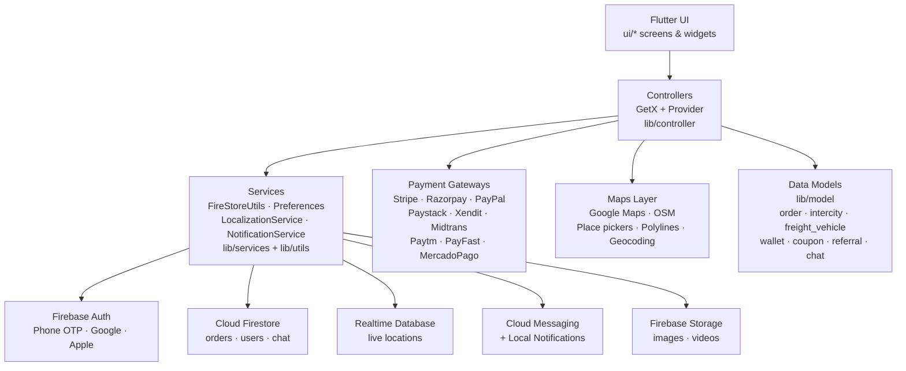

<p align="center">
  
</p>

<p align="center">
  
  
  
  
  
  
</p>

> **Developed by [Arslan Malik](https://github.com/arsalanmaalik461)**
> 📱 WhatsApp: [+92 300 8987448](https://wa.me/923008987448) · 🌐 Website: [arslanmalik.tech](https://arslanmalik.tech)

---

## 🌟 Executive Overview

**TownOnTruck User** is the customer-facing mobile application of the TownOnTruck freight marketplace, built with **Flutter** and backed by **Firebase**. It lets customers book freight vehicles and trucks for city moves, place intercity transport orders, track their shipments live on the map, chat with drivers, pay through a wide range of payment gateways, and manage wallets, coupons, referrals and reviews — all from one app. The app ships with English, Arabic and French localization and supports light and dark themes.

Under the hood the app follows a layered Flutter architecture: GetX and Provider controllers drive the UI, a services layer (`FireStoreUtils`, `LocalizationService`, `NotificationService`) handles backend access, and Firebase provides authentication (phone OTP, Google, Apple), Cloud Firestore, Realtime Database and push notifications. Maps run on both Google Maps and OpenStreetMap, with live order tracking powered by polylines and geocoding. Payments are handled natively in-app through Stripe, Razorpay, PayPal, Paystack, Xendit, Midtrans, Paytm, PayFast and Mercado Pago.

---

## 📑 Table of Contents

- [✨ Key Features & Highlights](#-key-features--highlights)
- [🖥️ Feature Showcase](#️-feature-showcase)
- [🏗️ System Architecture](#️-system-architecture)
- [🚀 Quickstart & Installation Guide](#-quickstart--installation-guide)
- [📂 Project Structure](#-project-structure)
- [🛡️ Security & Notes](#️-security--notes)

---

## ✨ Key Features & Highlights

| Feature | Description |
| :--- | :--- |
| 🚚 Freight & Truck Booking | Order freight vehicles with dedicated order screens (`ui/orders`) — order details, payment, live tracking and completion flows. |
| 🛣️ Intercity Orders | Separate intercity service module (`ui/interCity`, `ui/intercityOrders`) with accept/payment/complete screens for long-distance transport. |
| 📍 Live Order Tracking | Real-time driver location on Google Maps / OSM with route polylines (`live_tracking_screen`, `live_tracking_controller`). |
| 💬 In-App Chat | Customer ↔ driver conversations with inbox model, chat screens and video container support. |
| 💳 9 Payment Gateways | Stripe, Razorpay, PayPal, Paystack, Xendit, Midtrans, Paytm, PayFast and Mercado Pago, all wired under `lib/payment/`. |
| 👛 Wallet & Transactions | In-app wallet with full transaction history (`wallet_transaction_model`). |
| 🎟️ Coupons & Referrals | Promo coupon application (`coupon_controller`) and referral program with tracking (`referral_model`). |
| ⭐ Reviews & Ratings | Rate completed trips/drivers (`rating_controller`, `review_model`). |
| 🆘 SOS & Driver Rules | SOS support (`sos_model`) and driver rules display for safety. |
| 🗺️ Dual Map Providers | Google Maps place picker + OpenStreetMap search (`place_picker_osm`, `osm_map_search_place`) with geocoding. |
| 🔐 Multi Auth | Firebase Auth with phone OTP (`otp_screen`), Google Sign-In and Apple Sign-In. |
| 🌍 3 Languages | English, Arabic and French via `lib/lang` + `LocalizationService`. |
| 🌙 Dark Mode | Full dark theme via `DarkThemeProvider`. |
| 🔔 Push Notifications | Firebase Cloud Messaging + local notifications (`notification_service`). |

---

## 🖥️ Feature Showcase

### 1. Freight & Intercity Booking

> *"Book a truck or an intercity ride and follow it from pickup to drop-off."*

- Freight vehicle selection (`freight_vehicle.dart`) with zone, tax and admin-commission aware pricing models.
- Full order lifecycle: `order_screen → order_details_screen → payment_order_screen → live_tracking_screen → complete_order_screen`.
- Dedicated intercity flow (`intercity_order_screen`, `intercity_payment_order_screen`, `intercity_complete_order_screen`) plus an intercity service catalog model.
- Airport transfer support (`airport_model`).

### 2. Payments, Wallet & Promotions

> *"Pay your way — nine gateways, plus wallet, coupons and referrals."*

- Native in-app payment screens for Stripe, Razorpay (order creation + failure models), PayPal, Paystack, Xendit, Midtrans, Paytm, PayFast and Mercado Pago.
- Wallet top-up and transaction ledger (`wallet_controller`, `wallet_screen`).
- Coupon application during checkout and a referral program with reward tracking.
- Subscription plan model for recurring offerings.

### 3. Live Tracking & Communication

> *"See your shipment move on the map and stay in touch with the driver."*

- Live tracking with Google Maps polylines (`flutter_polyline_points`), driver marker view (`driver_view.dart`) and hold-timer flow.
- Google Maps + OSM place pickers, OSM nominatim search and `map_launcher` for external navigation.
- In-app chat (conversations + inbox), contact picker, share and email utilities.
- SOS model and driver rules screens for trip safety.

### 4. Accounts, Settings & Personalization

> *"Onboarding, profiles and settings that adapt to you."*

- Splash + onboarding screens, OTP/phone login, profile management with image picker.
- Settings screen, FAQ, contact-us, terms & conditions, privacy-policy language files.
- Dark theme provider, responsive helpers and Google Fonts styling.
- Dashboard + home screens with promotional banners (`banner_model`).

---

## 🏗️ System Architecture



The app is organized by feature: every screen group under `lib/ui` pairs with a controller in `lib/controller` and typed models in `lib/model`, keeping backend access centralized in `lib/utils/fire_store_utils.dart`.

---

## 🚀 Quickstart & Installation Guide

### Prerequisites

- **Flutter 3.32.4** via [FVM](https://fvm.app) (`fvm use 3.32.4`) — Dart SDK ≥ 3.4.0
- A Firebase project with **google-services.json** (Android) and **GoogleService-Info.plist** (iOS) added
- Google Maps API key configured for `google_maps_flutter`

### Step-by-Step Installation

```bash
# 1. Clone the repository
git clone https://github.com/arsalanmaalik461/TownOnTruck_User.git
cd TownOnTruck_User

# 2. Pin the Flutter version and fetch dependencies
fvm use 3.32.4
fvm flutter clean
fvm flutter pub get

# 3. Add your Firebase config files
#    android/app/google-services.json
#    ios/Runner/GoogleService-Info.plist

# 4. Run on a connected device or emulator
fvm flutter run

# 5. Build a release APK
fvm flutter build apk
```

---

## 📂 Project Structure

```
TownOnTruck_User/
├── lib/
│   ├── main.dart               # App entry point
│   ├── constant/               # App-wide constants
│   ├── controller/             # GetX controllers (one per feature)
│   ├── generated/              # Generated localization helpers
│   ├── lang/                   # Locales: app_en, app_ar, app_fr
│   ├── model/                  # Data models (order, intercity, freight_vehicle,
│   │                           # wallet, coupon, referral, chat, sos, ...)
│   ├── payment/                # Gateway screens: Stripe, Razorpay, PayPal,
│   │                           # Paystack, Xendit, Midtrans, Paytm, PayFast, MercadoPago
│   ├── services/               # LocalizationService, helper
│   ├── themes/                 # Colors, styles, buttons, responsive helpers
│   ├── ui/
│   │   ├── auth_screen/        # Login, OTP, information screens
│   │   ├── chat_screen/        # Customer ↔ driver chat
│   │   ├── coupon_screen/      # Coupons
│   │   ├── dashboard_screen.dart
│   │   ├── faq/ contact_us/ terms_and_condition/
│   │   ├── home_screens/       # Home with banners
│   │   ├── hold_timer/         # Order hold timer
│   │   ├── intercityOrders/    # Intercity order flow
│   │   ├── interCity/          # Intercity service
│   │   ├── on_boarding_screen.dart / splash_screen.dart
│   │   ├── orders/             # Freight order flow + live tracking
│   │   ├── profile_screen/ referral_screen/ review/
│   │   ├── settings_screen/    # Settings
│   │   └── wallet/             # Wallet + transactions
│   ├── utils/                  # FireStoreUtils, Preferences, NotificationService,
│   │                           # DarkThemeProvider
│   └── widget/                 # Reusable widgets (maps, pickers, separators)
├── android/ ios/               # Native platform shells
├── assets/                     # Images, icons, SVGs
├── docs/assets/banner.svg      # Repo banner
├── test/                       # Widget tests
├── firebase.json               # Firebase config
├── pubspec.yaml                # Dependencies
└── README.md
```

---

## 🛡️ Security & Notes

- **Firebase config**: `google-services.json` / `GoogleService-Info.plist` are environment-specific — keep them out of public forks and use per-environment files for staging/production.
- **API keys**: Google Maps and payment gateway keys must be stored outside version control (or restricted by bundle ID / SHA-1 in the provider console).
- **Payment credentials**: Stripe, Razorpay and other gateway secrets should be issued server-side where possible; never ship live secret keys in the client.
- **Auth**: phone OTP, Google and Apple sign-in go through Firebase Auth — keep Firebase security rules strict for orders, wallet and chat collections.
- No analytics, crash reporting or third-party trackers beyond the listed Firebase and payment SDKs are wired into the codebase.

---

<p align="center">
  <b>Developed by <a href="https://github.com/arsalanmaalik461">Arslan Malik</a></b><br>
  📱 <a href="https://wa.me/923008987448">+92 300 8987448</a> · 🌐 <a href="https://arslanmalik.tech">arslanmalik.tech</a>
</p>
